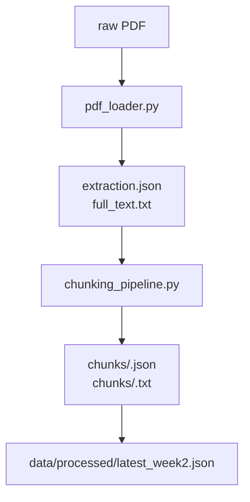

# 📘 2주차: PDF 전처리 & 청킹 실습

## 학습 목표
- PDF에서 텍스트/이미지 블록을 추출하는 방법 이해  
- 다양한 청킹 전략(고정 길이, 재귀, 문장, 단락, 의미)을 비교  
- Week3 임베딩 단계에 활용할 데이터 구조(`chunks/*.json`, `full_text.txt`) 준비

---

## 1. 데이터 준비 흐름


- `pdf_loader.py`: 텍스트 블록 + 이미지 메타데이터 추출 (옵션: OCR)  
- `chunking_pipeline.py`: 텍스트를 다양한 전략으로 분할 후 JSON/TXT 저장  
- `latest_week2.json`: 최근 처리된 출력 경로를 Week3가 참조

---

## 2. 핵심 스크립트 요약

| 파일 | 역할 | 비고 |
|------|------|------|
| `run_week2.py` | PDF → 추출 → 청킹 전체 파이프라인 | Hydra 설정 `conf/week2.yaml` |
| `pdf_loader.py` | 텍스트/이미지 추출, OCR 지원 | `--enable-ocr`, `--ocr-lang` |
| `pipeline_demo.py` | 전략별 청크 통계 미리보기 | 저장 없이 콘솔 출력 |
| `chunking_pipeline.py` | 각 전략 함수 정의 (고정, 재귀, 문장, 단락, 의미) | 개별 호출 가능 |

---

## 3. Hydra 실행 예시

```powershell
# 전체 PDF 처리 (기본 설정)
python src/week2/run_week2.py

# 특정 PDF + 전략 제한 + OCR 비활성화
python src/week2/run_week2.py ^
  pdf.inputs="[data/raw/sample.pdf]" ^
  chunking.strategies='["recursive","semantic"]' ^
  pdf.enable_ocr=false

# 최소 문자 길이 조정
python src/week2/run_week2.py pdf.min_text_length=30
```

---

## 4. 산출물 구조 체크
```
data/processed/<slug>/
 ├─ extraction.json           # 텍스트/이미지 블록 목록
 ├─ full_text.txt             # 하나로 연결한 전체 텍스트
 ├─ summary.json              # 전략별 통계
 └─ chunks/
     ├─ recursive.json / .txt # 전략별 청크
     ├─ sentence.json / .txt
     └─ ...
```

`summary.json` 예시:
```json
{
  "strategy": {
    "count": 120,
    "avg_size": 480.5,
    "min_size": 120,
    "max_size": 600
  }
}
```

---

## 5. 학습 노트

- **OCR 성능 팁**  
  - 스캔본의 경우 `pdf.enable_ocr=true` + `ocr_lang=kor+eng` 권장  
  - Tesseract 설치 및 환경 변수 `TESSERACT_CMD` 확인
- **청킹 전략 선택 가이드**  
  - `recursive`: 일반적인 RAG 기본값  
  - `sentence`/`paragraph`: 의미 단위 유지에 유리  
  - `semantic`: 임베딩 모델 필요, 느리지만 품질↑  
  - `fixed`: 단순하지만 문맥 손상 위험

---

## 6. 체크리스트
- [ ] `GOOGLE_API_KEY`는 아직 필요 없음  
- [ ] `data/raw/`에 테스트 PDF 배치  
- [ ] `python src/week2/run_week2.py` 실행 후 `latest_week2.json` 생성 확인  
- [ ] `chunks/*.json` 안에 `text`, `start`, `end`, `strategy` 필드가 있는지 점검  
- [ ] 의미 기반 전략 사용 시 `sentence-transformers` 모델 준비

---

## 7. 다음 단계 예고
- Week3에서 `chunks/*.json`을 읽어 임베딩을 생성하고 `index.faiss`를 만듭니다.  
- 실행 전 `data/processed/<slug>/` 구조가 올바른지 반드시 확인하세요.

