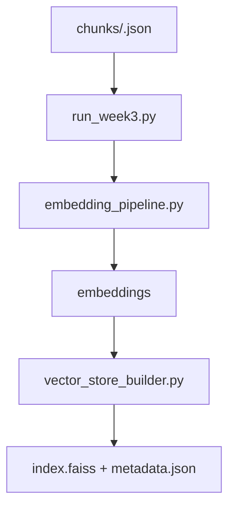

# 📗 3주차: 임베딩 생성 & 벡터 인덱스 구축

## 학습 목표
- Week2에서 생성된 청크(JSON/TXT)를 SentenceTransformer로 임베딩  
- FAISS 기반 벡터 인덱스를 생성해 검색 준비  
- 후속 RAG 단계(Week4~7)에서 사용할 표준 디렉터리 구조 이해

---

## 1. 데이터 흐름


---

## 2. 핵심 스크립트 요약

| 파일 | 역할 | 비고 |
|------|------|------|
| `run_week3.py` | 청크 로딩 → 임베딩 → 인덱스 저장 자동화 | Hydra `conf/week3.yaml` |
| `embedding_pipeline.py` | 텍스트 리스트 → `EmbeddingResult` 리스트 생성 | SentenceTransformer 사용 |
| `vector_store_builder.py` | 임베딩 → FAISS 인덱스 + 메타데이터 저장 | `/data/processed/index` |

---

## 3. Hydra 실행 예시
```powershell
# 최근 Week2 결과 전체 처리
python src/week3/run_week3.py

# 특정 청크 디렉터리만 처리
python src/week3/run_week3.py input.chunks_dir=data/processed/그랜드코리아레저_.../chunks

# 전략 제한 + 의미 임계값 조정
python src/week3/run_week3.py \
  input.strategies='["recursive","semantic"]' \
  chunking.semantic.similarity_threshold=0.8

# 결과 저장 위치 변경
python src/week3/run_week3.py vector_store.base_dir=data/processed/index/custom
```

---

## 4. 산출물 구조
```
data/processed/index/<slug>/<strategy>/
 ├─ index.faiss           # FAISS 벡터 인덱스
 ├─ metadata.json         # EmbeddingResult (doc_id, text, vector)
 └─ chunks_with_ids.json  # 원본 chunk + doc_id 매핑
```

`metadata.json` 예시:
```json
[
  {
    "doc_id": "recursive_00001",
    "text": "청크 내용...",
    "vector": [0.123, 0.456, ...]
  }
]
```

---

## 5. 임베딩 모델 메모
- 기본값: `sentence-transformers/all-MiniLM-L6-v2`  
- 한국어 성능이 더 필요한 경우 Hydra override로 다른 모델 지정 가능  
  ```powershell
  python src/week3/run_week3.py embedding.model_name=snunlp/KR-SBERT-V40K-klueNLI-augSTS
  ```
- CPU만으로도 실행 가능하지만 GPU 사용 시 속도 향상

---

## 6. 체크리스트
- [ ] `data/processed/<slug>/chunks/*.json` 존재  
- [ ] `GOOGLE_API_KEY`는 아직 필요 없음  
- [ ] 실행 후 `data/processed/index/<slug>/<strategy>/index.faiss` 생성  
- [ ] `metadata.json` 내의 `vector` 길이가 모델 차원과 일치하는지 확인  
- [ ] `latest_week2.json`가 가리키는 청크 경로가 유효한지 점검

---

## 7. 문제 해결 팁
- `No chunks found` 에러 → Week2 산출물 경로/전략 이름 확인  
- `vector size mismatch` → 모델을 변경한 경우 이전 인덱스 삭제 후 재생성  
- `ImportError: faiss` → `requirements.txt`를 통해 설치되어야 함

---

## 8. 다음 단계 예고
- Week4에서 `index.faiss` + `metadata.json`을 기반으로 RAG 체인을 구성합니다.  
- QA 테스트 및 평가를 위해 인덱스 경로만 정확히 기억해 두세요.

