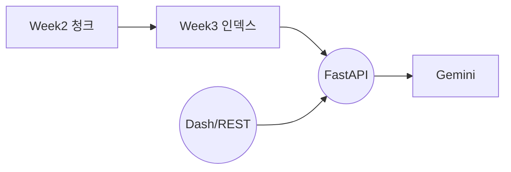

# 📘 6주차: FastAPI 기반 RAG 서비스 배포

## 학습 목표
- Week4에서 구성한 RAG 체인을 FastAPI 서버로 제공  
- `POST /query` 엔드포인트를 통해 질문-응답 서비스 검증  
- Docker 또는 로컬 환경에서 안정적으로 실행하는 방법 이해

---

## 1. 서비스 구조


---

## 2. 주요 구성 파일

| 파일 | 역할 | 비고 |
|------|------|------|
| `run_week6.py` | Hydra 설정 → 인덱스 탐색 → FastAPI 실행 | `conf/week6.yaml` |
| `api_server.py` | FastAPI 앱 정의, `create_app()` | `POST /query` |
| `smoke_test.py` | 간단한 API 호출 테스트 스크립트 | 선택 사용 |

---

## 3. Hydra 실행 예시
```powershell
# 기본 실행 (포트 8000)
python src/week6/run_week6.py

# 호스트/포트 변경
python src/week6/run_week6.py server.host=127.0.0.1 server.port=9000

# 다른 인덱스 경로 지정
python src/week6/run_week6.py paths.index_root=data/processed/index/221123

# 최신 포인터 무시, 모든 인덱스 재검색
python src/week6/run_week6.py index_selection.prefer_pointer=false

# 모델 변경
python src/week6/run_week6.py rag.model_name=gemini-2.5-flash

# MMR + LLM 파라미터 조정
python src/week6/run_week6.py ^
  rag.use_mmr=true ^
  rag.mmr_diversity=0.5 ^
  rag.temperature=0.0 ^
  rag.top_p=0.8 ^
  rag.top_k=32
```

**참고**: 인덱스 경로는 자동으로 탐색됩니다. `index.faiss` 파일이 있는 디렉토리를 재귀적으로 찾아 사용합니다.

---

## 4. API 사용법

### 4.1 Swagger UI
- 서버 실행 후 `http://localhost:8000/docs` 접속 → `POST /query`
- Request Body 예:
  ```json
  {
    "question": "LangChain RAG 파이프라인을 요약해줘",
    "top_k": 5
  }
  ```
- Response 예:
  ```json
  {
    "answer": "..."
  }
  ```

### 4.2 curl
```bash
curl -X POST http://localhost:8000/query \
     -H "Content-Type: application/json" \
     -d '{"question": "LangChain RAG 파이프라인을 요약해줘", "top_k": 5}'
```

---

## 5. 설정 포인트

- **GOOGLE_API_KEY**: 필수 (환경 변수 또는 `.env` 파일)  
- **index_root**: 인덱스 루트 경로 (기본: `data/processed/index`)  
- **model_name**: 사용 가능한 Gemini 모델 지정 (기본: `gemini-2.5-flash`)  
- **prefer_pointer**: `latest_week2.json` 포인터 파일 우선 사용 여부  
- **recursive_search**: 인덱스 루트 하위 재귀 검색 여부

---

## 6. 체크리스트
- [ ] Week3 인덱스 생성 완료 (`data/processed/index/...`)  
- [ ] `GOOGLE_API_KEY` 환경변수 설정  
- [ ] FastAPI 서버 실행 후 Swagger 또는 curl로 테스트  
- [ ] Docker 사용 시 `/app/data`에 인덱스를 마운트  
- [ ] 타임아웃 발생 시 모델 호출 속도 확인 및 `httpx` timeout 조정 검토
- [ ] MMR/LLM 파라미터 override가 FastAPI에 반영되는지 확인 (`rag.*` 항목)

---

## 7. 문제 해결
- `metadata.json을 찾을 수 없습니다` → 인덱스 경로 재확인, `index.faiss`와 같은 디렉토리에 있는지 확인  
- `Connection refused` → 서버 미실행, 포트 충돌 체크  
- `timed out` → LLM 응답 지연, 네트워크 상태 점검 (Gemini API)  
- Docker에서 Dash 연동 시 `ui.api_endpoint`를 `http://week6:8000/query`로 설정 (서비스 이름 사용)

---

## 8. Docker 실행

```bash
# Week6만 실행
docker-compose --profile week6 up

# Week6와 Week7 동시 실행
docker-compose --profile full up
```

자세한 내용은 `README_DOCKER.md`를 참조하세요.

---

## 9. 실제 실행 결과 요약
- 테스트 스크립트: `python scripts/test_new_features.py`
- 결과 JSON: `outputs/feature_tests/test_results_1763105331.json`
- Week6 관련 관찰
  | 항목 | 기본 설정 | 메모 |
  |------|-----------|------|
  | 응답 속도 | 11.34초 (top_k=5) | `temperature=0.0`일 때 9.58초 |
  | MMR ON | 11.11초, 답변 824자 | 기본 대비 0.6초 빠르고 더 간결 |
  | API 안정성 | 재시도 없이 성공 | `httpx` timeout 기본값으로도 통과 |
- 상세 리포트: `docs/results/ACTUAL_EXECUTION_RESULTS.md`

---

## 10. 다음 단계 예고
- Week7에서 Dash UI를 실행해 사용자에게 시각적인 질의응답 인터페이스를 제공합니다.  
- FastAPI 서버가 먼저 실행 중이어야 Dash UI에서 정상 응답을 받을 수 있습니다.

